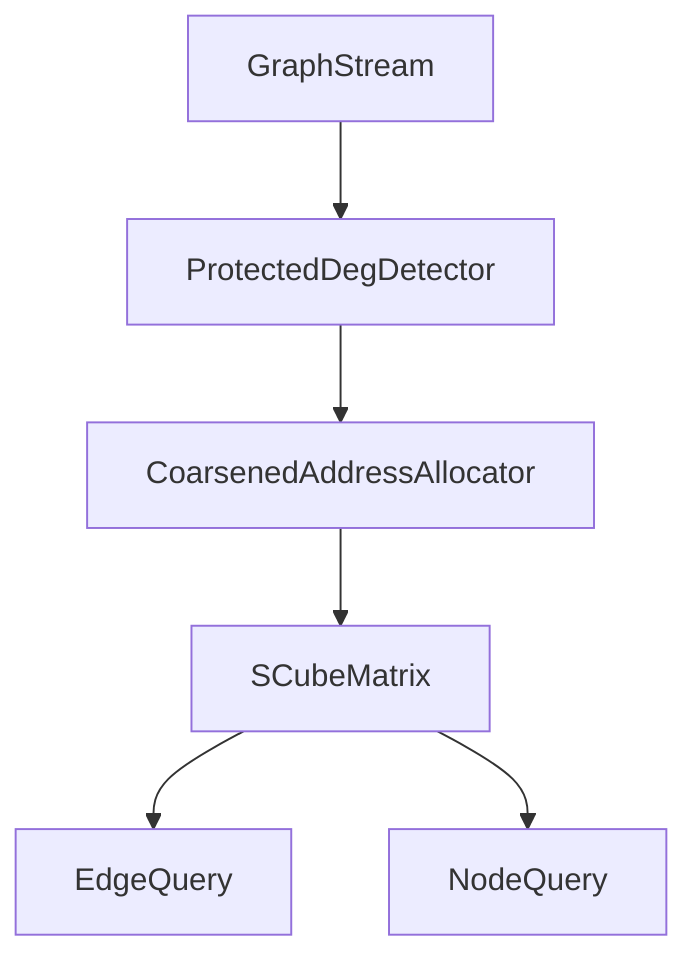

# Privacy-Preserving Skew-Aware Graph Stream Summarization

## 论文一句话定位

> We show that skew-aware optimization improves hub utility but simultaneously amplifies hub privacy leakage in graph stream summaries, and we mitigate this tension with selective protection.

这篇论文不再泛化讨论所有结构隐私问题，而是聚焦一个更强、更清晰、也更容易写成投稿论文的主线：

- `SCube` 为高度节点提供更高精度和更低碰撞。
- 这种 skew-aware 优化也让高度节点更容易被识别。
- 我们围绕 `hub/high-degree leakage` 做攻击分析、统一评估，并提出轻量防御 `P-SCube`。

---

## 1. Problem Focus

### 1.1 背景

图流摘要结构通过压缩矩阵和指纹机制近似维护大规模动态图。典型代表包括：

- `TCM`：固定哈希矩阵，所有节点处理方式一致。
- `GSS`：指纹加缓冲区，降低部分碰撞，但仍是 skew-unaware。
- `SCube`：通过 `DegDetector` 识别高频节点，并为其分配更多地址，是典型的 skew-aware summary。

`SCube` 的优势在于：它不会平均对待所有节点，而是优先保障高度节点的插入和查询质量。

### 1.2 本文收缩后的核心问题

本文只回答两个问题：

1. `SCube` 是否比 `GSS` 更容易泄露 `hub/high-degree structure`？
2. 能否在不明显破坏 skew-aware 优势的前提下，降低这种泄露？

我们**不把论文主线**放在以下方向上：

- 不做完整的 graph differential privacy 框架。
- 不把敏感边存在性推断作为主贡献。
- 不追求覆盖所有 summary 内部信号和所有攻击面。

### 1.3 核心观察

你的 `privacy_demo` 已经提供了非常好的引子，说明 `query-only` 攻击就足以恢复高度节点结构：

- `Top-K hub extraction` 在合成 Zipf 图上接近完美：
  - `Precision@10 = 100%`
  - `Precision@20 = 100%`
  - `Precision@50 = 98%`
- `Timing-based degree inference` 也具有明显信号：
  - 分类准确率 `92.64%`
  - hub recall `100%`
  - degree-latency Pearson `r = 0.5037`

这意味着论文完全可以从一个明确命题出发：

> `SCube` 对 hub 的优化越强，hub 被抽取出来的风险也越高。

### 1.4 关注的泄露面

为保持主线集中，本文只保留与 `hub/high-degree leakage` 直接相关的两类结构信号。

#### 信号 A: Detector-State Leakage

`DegDetector` 中的 `update_times` 和 `address_number` 共同构成了一个高度节点索引器。

它带来的核心风险不是“完全重建图”，而是：

- 排序谁是 top-K hub
- 判断某个节点是否属于 hub 类
- 估计节点属于哪个 degree class

#### 信号 B: Query-Path Leakage

`nodeWeightQuery()` 的返回值精度与扫描路径都受到 `address_number` 影响，因此泄露出：

- 查询值上的高精度排序信号
- 延迟上的 degree-correlated 侧信道

`occupancy`、`kick-out` 和 `ext` 仍可在 related discussion 中提及，但不再作为论文主攻击线。

### 1.5 正式问题定义

给定 summary `S`、攻击者 `A`、节点集合 `V`，攻击者试图从 `S` 中恢复与高阶节点相关的结构属性。本文关注的目标是：

- `Top-K extraction`: 恢复度数最高的 K 个节点。
- `Hub membership inference`: 给定节点 `v`，判断其是否为 hub。
- `Timing-based degree inference`: 仅根据查询延迟推断节点度类。

我们的目标是同时量化：

- `Leakage gain`: `SCube` 相比 `GSS` 多泄露了多少。
- `Mitigation gain`: `P-SCube` 相比 `SCube` 降低了多少泄露。
- `Utility cost`: 为隐私保护付出的查询精度和延迟代价。

---

## 2. Threat Model And Attack Tasks

### 2.1 攻击者能力

保留一个简单但足够强的三层模型：

| Level | 名称 | 能力 | 本文角色 |
|------|------|------|----------|
| `L1` | `Query-only` | 只能调用公开查询接口 | 主实验场景 |
| `L2` | `Summary-observable` | 可观察 latency 或统计量 | 辅助解释场景 |
| `L3` | `Internal-access` | 可直接读取 detector 状态 | 上界分析场景 |

正文实验优先做 `L1`，因为这最容易说服审稿人：**不需要内部读权限也会泄露**。

### 2.2 攻击者知识

- 已知 summary 类型和主要参数。
- 已知哈希函数族和查询接口。
- 不知道真实图流内容。

### 2.3 主攻击任务

#### Attack 1: Top-K Hub Extraction

目标：根据 summary 查询结果恢复 top-K 高度节点。

推荐实现：

- 对所有候选节点调用 `nodeWeightQuery(v, 0)`。
- 按返回值排序，得到攻击者视角的 ranking。
- 对比真实 top-K，报告 `Precision@K`、`Recall@K`、`NDCG@K`。

这是整篇论文的**核心攻击任务**，也是最好讲清楚的一条主线。

#### Attack 2: Hub Membership Inference

目标：给定节点 `v`，判断其是否为 hub。

推荐实现：

- 用 `nodeWeightQuery` 返回值、延迟或 detector 信号构造判别器。
- 将节点二分类为 `hub / non-hub`。
- 报告 `AUC`、`TPR@FPR=0.1`、`F1`。

它比 top-K 更接近标准隐私推断任务，也更适合与你的统一指标对接。

### 2.4 辅攻击任务

#### Attack 3: Timing-Based Degree Inference

目标：不看返回值，仅依据查询延迟判断节点的度类别。

用途：

- 证明泄露不只来自查询值本身。
- 支撑“query-path 也是泄露源”的论点。

建议它作为辅攻击，而不是论文标题级任务。

### 2.5 降级为补充实验的任务

以下内容可保留在附录或补充材料：

- `Sensitive edge probing`
- `Temporal burst detection`
- 针对 `occupancy` 或 `ext` 的更强内部攻击

原因很简单：它们会让论文变宽，但不会明显增强当前主线。

### 2.6 与 GSS 的对比定位

本文不需要证明“`SCube` 在所有维度都更不隐私”，只需要证明：

- `GSS` 没有显式的 degree-aware promotion。
- `SCube` 通过 detector 和动态地址分配优先保障 hub。
- 这种优待导致 hub 更容易被抽取和识别。

这足以形成强论文命题。

---

## 3. Method: P-SCube

### 3.1 设计原则

`P-SCube` 只做两件事：

1. 打破 `degree -> address_number` 的确定性映射。
2. 降低攻击者对细粒度 degree level 的可分辨性。

因此我们只保留两个核心机制：

- `Noisy degree promotion`
- `Coarsened address allocation`

其余机制不作为主方法：

- 不做 `salted remapping`
- 不做 `ext obfuscation`
- 不做默认的 query-value noise

这样系统改动更小，方法叙事也更干净。

### 3.2 总体架构



这里真正被修改的只有 detector 到地址分配这一层，矩阵主体和查询接口尽量保持 `SCube` 原状。

### 3.3 机制 1: Noisy Degree Promotion

#### 目标

降低攻击者通过 detector 状态或查询结果稳定恢复 hub ranking 的能力。

#### 核心思想

原始 `SCube` 中，节点是否升级基本由 degree threshold 决定，因而 `address_number` 与真实 degree 呈近似单调关系。

`P-SCube` 引入受控随机化，把“确定升级”改成“概率升级”。

#### 形式化描述

原始规则：

```text
promote if score(v) >= theta
```

修改后：

```text
promote if score(v) + eta >= theta
eta ~ Laplace(0, lambda)
```

其中：

- `score(v)` 可由 `update_times * exp_deg` 近似表示。
- `lambda` 是保护强度，越大说明 promotion 抖动越强。

#### 直观作用

- 近阈值节点不再稳定地被排成固定先后。
- `address_number` 不再是 degree 的精确代理。
- top-K 排名会更不稳定，hub membership 推断也会更困难。

#### 实现落点

优先落在 `DegDetectorSlot2bit::insertSlot()` 或等效的 promotion 逻辑中。

### 3.4 机制 2: Coarsened Address Allocation

#### 目标

避免 `address_number = 2, 3, 4, 5, ...` 这种细粒度级别本身成为 degree fingerprint。

#### 核心思想

允许 `SCube` 继续偏向 hub，但不允许它精确暴露 hub 的等级。

#### 推荐离散级别

将地址数限制为少量离散桶：

- `low`: `2`
- `mid`: `4`
- `high`: `6`

如果实现更方便，也可以使用 `{2, 4, 8}`，但正文叙事上建议强调“少量等级”，而不是“无限精细扩展”。

#### 形式化描述

```text
raw_addr(v) = original detector output
addr(v) = bucketize(raw_addr(v))
```

例如：

```text
if raw_addr <= 2 -> 2
if 3 <= raw_addr <= 4 -> 4
if raw_addr >= 5 -> 6
```

#### 直观作用

- 多个 degree 不同的节点会共享同一 address level。
- detector 保留了 skew-aware 资源倾斜，但减少了可识别度。
- 方法更容易说明复杂度和工程代价。

#### 实现落点

优先落在 `DegDetectorSlot2bit::addrQuery()` 或地址返回逻辑上。

### 3.5 为什么只保留这两个机制

这是论文能否“像投稿论文”的关键。

只保留两项机制有三个好处：

- 与泄露源强绑定：都直接作用于 hub 可识别性。
- 实现改动更小：主要集中在 detector 层。
- 评估更清晰：一张 tradeoff 图就能解释清楚。

### 3.6 主方法卖点

`P-SCube` 不是试图让 summary “彻底不可攻击”，而是要达成以下目标：

- 相比 `SCube`，显著降低 hub extraction 和 hub membership 的攻击成功率。
- 相比全局加噪基线，保留更多 utility。
- 相比 `GSS`，尽可能维持 skew-aware 的性能优势。

---

## 4. Unified Metrics And Analysis

### 4.1 为什么需要统一指标

当前最需要补强的不是再增加攻击种类，而是给全文一个统一的量化语言。本文建议以 `inference-oriented privacy` 为主，而不是强行套全局 `DP`。

### 4.2 核心指标

#### Metric 1: Attack Success

不同攻击任务使用其自然指标：

- `Top-K extraction`: `Precision@K`, `Recall@K`, `NDCG@K`
- `Hub membership`: `AUC`, `F1`, `TPR@fixed FPR`
- `Timing inference`: `Accuracy`, `Macro-F1`

#### Metric 2: Attack Advantage

定义攻击优势：

```text
AttackAdv = AttackSuccess - RandomBaseline
```

其中：

- 对 top-K，可用随机选 K 个节点的期望命中率作为 baseline。
- 对 hub membership，可用随机二分类或先验比例分类器作为 baseline。

这个量把“攻击到底比瞎猜强多少”说清楚了。

#### Metric 3: Leakage Gain

衡量 `SCube` 相比 `GSS` 的额外泄露：

```text
LeakageGain(SCube, GSS) = AttackAdv(SCube) - AttackAdv(GSS)
```

如果该值显著大于 0，就说明 `skew-awareness` 带来了附加泄露。

#### Metric 4: Mitigation Gain

衡量 `P-SCube` 相比 `SCube` 的缓解效果：

```text
MitigationGain = AttackAdv(SCube) - AttackAdv(P-SCube)
```

#### Metric 5: Utility Cost

使用三个维度衡量：

- `ARE` for edge query
- `ARE` for node query
- query latency / insertion throughput

### 4.3 论文中统一的主叙事

全文都围绕这三句话展开：

- `SCube` 带来 `utility gain`
- `SCube` 同时带来 `leakage gain`
- `P-SCube` 通过 selective protection 降低 `leakage gain`，并把 `utility cost` 控制在可接受范围内

### 4.4 建议保留的理论部分

理论部分要收缩成两个命题即可，不必写成过宽的四定理结构。

#### 命题 1: Skew-Aware Promotion Amplifies Hub Distinguishability

在 power-law 度分布下，若高阶节点得到更大地址空间与更稳定查询精度，则攻击者对 hub 的排序和识别能力将系统性高于 skew-unaware baseline。

这个命题主要服务于 `LeakageGain(SCube, GSS) > 0`。

#### 命题 2: Coarsening And Noisy Promotion Increase Indistinguishability

当 promotion 阈值被随机化且地址级别被桶化后，多个相近 degree 节点会映射到同一 observable class，从而降低攻击者的可分辨性。

这个命题主要服务于 `MitigationGain > 0`。

### 4.5 理论部分不要做什么

- 不必承诺严格的 end-to-end `epsilon-DP`
- 不必证明所有攻击面都能被形式化保护
- 不必引入复杂的 graph neighboring relation

理论目标是“支撑机制直觉”，不是把论文转成纯理论稿。

---

## 5. Evaluation Plan

### 5.1 系统与基线

主实验只保留三类系统：

- `GSS`
- `SCube`
- `P-SCube`

补充基线保留一个即可：

- `SCube + GlobalNoise`

这样能更突出 `selective protection` 的价值。

### 5.2 数据集选择

建议正文以两个数据集为主：

- `wiki-talk`：偏斜更强，适合展示泄露
- `stackoverflow`：中等偏斜，适合展示泛化

其余数据集可视时间补充到附录。

### 5.3 五组核心实验

#### E1. Leakage Comparison

目的：证明 `SCube` 比 `GSS` 更容易泄露 hub structure。

任务：

- top-K hub extraction
- hub membership inference
- timing-based degree inference

输出图表：

- `Precision@K` 曲线
- `AUC` 对比柱状图或 ROC
- latency-based classification 对比图

#### E2. Privacy Effectiveness

目的：证明 `P-SCube` 能降低攻击成功率。

自变量：

- `lambda`
- address bucket granularity

输出图表：

- `Precision@K` 随保护强度变化
- `AUC` 随保护强度变化

#### E3. Utility Preservation

目的：证明防御并未明显破坏查询质量。

指标：

- edge query `ARE`
- node query `ARE`

#### E4. Performance Overhead

目的：量化防御代价。

指标：

- node query latency
- edge query latency
- insertion throughput

#### E5. Privacy-Utility Frontier

这是全文最重要的一张图。

推荐画法：

- x 轴：保护强度
- y 轴：攻击成功率或 `AttackAdv`
- 另一条 y 轴：`ARE` 或 latency overhead

你要展示的不是“某个参数最好”，而是：

> `P-SCube` 在同等 utility cost 下，比全局加噪泄露更低。

### 5.4 Ablation Study

只做最必要的消融：

- `SCube`
- `+ NoisyPromotion`
- `+ CoarsenedAllocation`
- `P-SCube(full)`

这样才能清楚回答两个问题：

- 哪个机制主要负责降泄露？
- 哪个机制主要带来 utility 代价？

### 5.5 建议默认参数

| 参数 | 默认值 | 变化范围 | 作用 |
|------|--------|----------|------|
| `lambda` | `0.5 * theta` | `{0.1, 0.2, 0.5, 1.0} * theta` | promotion 随机化强度 |
| `address buckets` | `{2, 4, 6}` | `{2,4,6}` 或 `{2,4,8}` | 地址粗化粒度 |
| `K` | `50` | `{10, 20, 50, 100}` | top-K 攻击规模 |

### 5.6 论文里最关键的三个结论

最终实验必须支撑以下三点：

1. `SCube` 的 hub leakage 显著高于 `GSS`。
2. 泄露主要来自 skew-aware promotion，而不是普通 sketch 的共性误差。
3. `P-SCube` 能在较小 utility cost 下显著降低 hub leakage。

---

## 6. Contributions And Paper Structure

### 6.1 三点贡献

建议最终只写三点贡献。

1. **问题贡献**：首次揭示 skew-aware graph stream summarization 中由 hub-oriented optimization 引起的结构隐私泄露，并将其收敛为 `hub/high-degree leakage` 这一可验证主问题。

2. **方法贡献**：提出轻量级 `P-SCube`，仅通过 `noisy degree promotion` 和 `coarsened address allocation` 两个机制，在保留 skew-aware 优势的同时降低 hub 可识别性。

3. **实验贡献**：建立面向 summary 查询接口的隐私评估框架，使用 `AttackAdv`、`LeakageGain` 和 privacy-utility frontier 系统比较 `GSS`、`SCube` 和 `P-SCube`。

### 6.2 六节正文结构

建议把正文稳定为六节：

1. `Introduction`
2. `Background and Threat Model`
3. `Privacy Leakage Analysis of SCube`
4. `P-SCube Design`
5. `Evaluation`
6. `Conclusion`

其中：

- 第 3 节只讲主攻击和主泄露面，不展开所有内部信号。
- 第 4 节只讲两个机制。
- 第 5 节围绕一张 privacy-utility frontier 主图组织。

### 6.3 每节写作要点

#### Section 1: Introduction

- 先讲 skew-aware summary 为什么重要。
- 再指出“对 hub 更友好”可能意味着“hub 更可识别”。
- 用你的 `privacy_demo` 结果作为 motivating example。

#### Section 2: Background and Threat Model

- 简要介绍 `GSS` 与 `SCube` 的差异。
- 定义 `L1/L2/L3` 攻击者。
- 明确本文只关注 hub/high-degree leakage。

#### Section 3: Privacy Leakage Analysis of SCube

- 给出 top-K extraction 和 hub membership 两个核心任务。
- 解释 detector-state 和 query-path 两类泄露源。
- 用 demo 结果展示 query-only 攻击已足够强。

#### Section 4: P-SCube Design

- 先讲设计原则：selective, lightweight, bounded-cost。
- 再分别介绍 `NoisyPromotion` 和 `CoarsenedAllocation`。
- 最后说明为什么不采用更重的全局机制。

#### Section 5: Evaluation

- 对比 `GSS / SCube / P-SCube`
- 按 `leakage -> utility -> overhead -> frontier` 顺序组织
- 用一张主图串起全文

#### Section 6: Conclusion

- 重申 skew-aware optimization 的双刃剑本质
- 强调 `P-SCube` 不是取消 skew-awareness，而是给它加 selective protection

---

## 7. Implementation Roadmap

### Phase 1: 固化攻击主线

优先整理和保留以下攻击代码与图表：

- `Top-K hub extraction`
- `Hub membership inference`
- `Timing-based degree inference`

`Sensitive edge probing` 保留为补充结果即可。

### Phase 2: 实现 P-SCube Lite

只修改 detector 相关逻辑：

- 在 `DegDetectorSlot2bit.h` 中加入 `noisy promotion`
- 在 `DegDetectorSlot2bit.h` 或等效地址返回逻辑中加入 `coarsened allocation`

尽量不要修改矩阵主体结构。

### Phase 3: 围绕主图组织实验

最优先跑通以下图：

- `SCube vs GSS` 的 hub extraction 对比
- `SCube vs P-SCube` 的 protection-strength 曲线
- privacy-utility frontier

### Phase 4: 写作收口

写作时始终围绕一句话：

> Better hub utility in skew-aware summaries leads to better hub extractability, and selective protection can weaken this coupling.

---

## 8. 风险与写作注意事项

### 8.1 不要把论文写成“SCube 不安全”

更准确的表述是：

`SCube` 的 skew-aware 设计带来了一个此前未被讨论的结构隐私副作用。

### 8.2 不要把论文写散

如果继续同时讲：

- occupancy
- ext
- kick-out
- edge probing
- burst detection

论文会重新变成“大而全草案”，而不是投稿版主线。

### 8.3 不要默认使用重型隐私框架

这篇工作更适合：

- `inference privacy`
- `attack advantage`
- `privacy-utility tradeoff`

而不是强行套全局 `DP`。

### 8.4 结果预期

一个健康的结果模式应当是：

- `SCube` 明显优于 `GSS` 的 hub 攻击成功率
- `P-SCube` 明显低于 `SCube` 的 hub 攻击成功率
- `P-SCube` 的 utility 和 latency 损失小于全局加噪基线

如果能做到这一点，这篇论文的故事就成立了。
